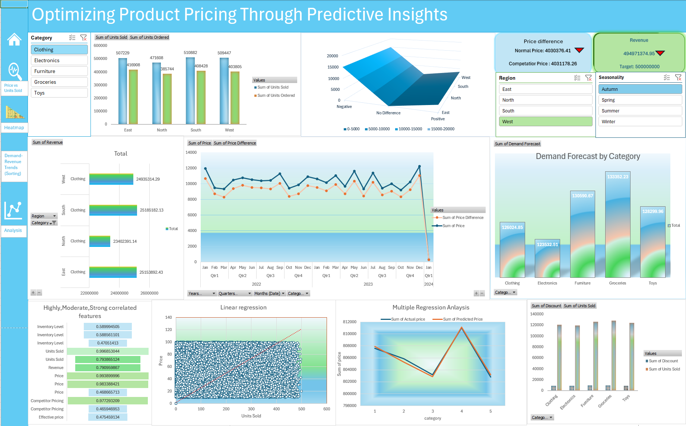
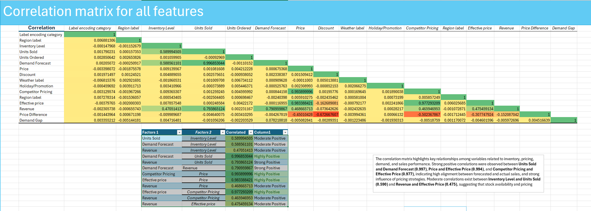

# 🔗 Project Explanation
For a detailed explanation of the project scope, goals, and methodology, refer to the following document:

[📄 View Project Explanation By Recording](https://drive.google.com/file/d/1uYNvZjX2HhHE8h1CUBpuGvtWlzJX5ZUe/view?usp=sharing)

# 📊 Strategic Pricing & Sales Performance Analysis

This project presents a comprehensive analysis of pricing, revenue, discounts, and sales performance across four major regions and five product categories: **Clothing, Electronics, Furniture, Groceries, and Toys**.

## 🧠 Project Goal

Evaluate pricing strategies, benchmark against competitors, identify revenue opportunities, and optimize sales through dynamic pricing models.

---

## 📍 Key Findings

### ✅ Sales vs. Orders (Regional Performance)
![Units Sold vs Orders by Region]
> All regions sold more units than ordered – suggesting strong demand, backorders, or real-time sales fulfillment.

- **South**: Highest surplus – indicates high demand or aggressive strategy
- **West**: Smallest surplus – may reflect tight inventory or low demand

---

## 💡 Dashboard Insights

### 🔍 Price Difference Panel
![Price Comparison Chart]

- **Normal Price**: ₹4,030,376.41  
- **Competitor Price**: ₹4,031,178.26  
- Both prices are decreasing – suggesting a market-wide trend or competitive pricing.

---

### 💰 Revenue Performance Panel
![Revenue Performance Gauge]

- **Actual**: ₹494.97M  
- **Target**: ₹500M  
- Shortfall of ₹5M due to price cuts, demand softness, or promotional gaps

---

## 📈 Regional & Category Insights

![Revenue by Region and Category]

- **Clothing**: Dominates in South & East
- **North**: Underperforms – requires strategy reevaluation
- **West**: Balanced performance

---

## 📊 Trend Analysis

### 🔄 Price and Price Difference Over Time
![Price Trends]

- Notable **dip in Jan 2024**
- Dynamic changes suggest active pricing strategies
- Close tracking between actual and competitor prices

---

## 📌 Correlation Matrix

- **Units Sold ↔ Forecast Demand**: 0.997  
- **Price ↔ Competitor Pricing**: 0.994  
- **Revenue ↔ Units Sold**: 0.794

> Strong relationships confirm the value of forecasting and competitor benchmarking.

---

## 📉 Linear Regression: Price vs. Units Sold

![Linear Regression Plot]

- Positive slope implies **pricing power** in some categories
- Moderate variability due to external factors

---

## 🤖 Multiple Regression Output

![Regression Model Summary]

- Predicts price using:
  - Units Sold
  - Forecast Demand
  - Competitor Pricing
- **R² ≈ 0.99** – Excellent model fit
- **Competitor Price** = Most influential factor

---

## 💸 Discounts vs. Sales Volume

![Discount vs Sales Scatterplot]

- Discounts are not always linked to higher sales
- **Clothing & Furniture** show strong performance without deep discounts
- Suggests value and brand strength

---

## 🧭 Strategic Recommendations

- 🧩 Use **dynamic pricing** based on region and season
- 📈 Raise prices in inelastic categories like **Furniture and Clothing**
- 🎯 Reduce discounts when unnecessary
- 📊 Focus marketing in **North**, expand in **South & East**
- 🔍 Regularly benchmark against competitors using regression-based pricing models

---

## 📂 Dataset

- 73,000+ records across:
  - Prices
  - Units Sold
  - Discounts
  - Forecast Demand
  - Competitor Prices
  - Revenue

---

## 🛠 Tools Used

- **Excel** – Forecast Sheet, Pivot Charts, Slicers ,Pivot tables, Data analysis 

---

## 🚀 Impact

This project helps retailers and analysts:
- Identify **underpriced** and **overpriced** products
- Use data science to guide **revenue-maximizing pricing**
- Align strategies across regions with evidence-based models

---
(File size is too large, download and see)
Link: https://docs.google.com/spreadsheets/d/1BmuoxSE3vVtc-el4KB44ydgZoAfKoBPG/edit?usp=drive_link&ouid=103048089483700373584&rtpof=true&sd=true

